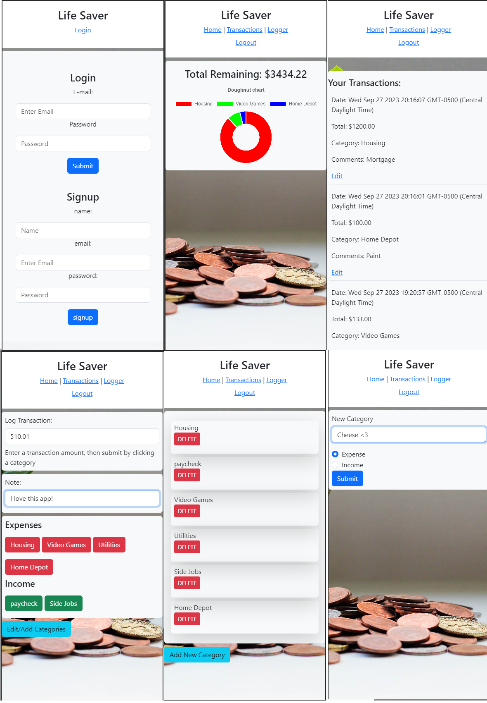

# life-saver-budget

## Table of Content 

- [Description](#description)
- [Installation](#installation)
- [Usage](#usage)
- [License](#license)
- [Contributing](#contributing)
- [Tests](#tests)
- [Questions](#questions)

## Direct Link to Application

[Direct Link to site](https://lifesaver-473061b66352.herokuapp.com/ "https://lifesaver-473061b66352.herokuapp.com/")

## Screenshots

## Description 

This application allows users to track and categories their transactions. It was developed with the MVC paradigm and uses MySQL and the Sequelize ORM. Additionally, ChartJS is used on the homepage to display the user's expenses summed by category.

## Installation 

Please check the listed depencies and install before running using npm i.

    bcrypt: 5.0.0
    connect-session-sequelize: 7.0.4
    dotenv: 8.2.0
    express: 4.17.1
    express-handlebars: 5.2.0
    express-session: 1.17.1
    mysql2: 2.2.5
    sequelize: 6.3.5

## Usage 

Use this app to track expenses and income.\

-   View a pie chart of expenses grouped by category on the homepage. Your balance (income - expenses) is also displayed at the top.

-   Use the logger page to log transactions by entering an amount (as a positive) and then clicking a category.  Use the "Edit/Add Categories" to either edit, delete, or add categories. Within "Add New Category," enter a category name, and choose whether it is an Expense or Income item by using the radio buttons.

-   Navigate to the transactions screen to view your spending.  Your transactions are in order of most recent to least recent. You can use the "edit" button to modify a transaction. Enter your updates and then click "submit" to save your changes.

## License 
MIT

## Questions

For questions, please refer to the below list for our GitHub information

## Contributors
Michael Lee github.com/leex3683\
Linh Lien github.com/liex149\
Vilson Apostolovski github.com/thinker92\
Blessing Babarinde github.com/blessingBab